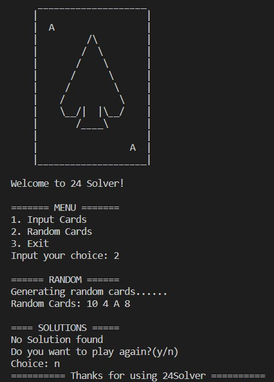

# Tucil1_13521100
Tugas Kecil Mata Kuliah IF2211 Strategi Algoritma 2023 - 24 Card Game Solver

## **Table of Contents**
* [General Information](#general-information)
* [Requirements](#requirements)
* [How to Run The Program](#how-to-run-the-program)
* [Implementation Screenshots](#implementation-screenshots)
* [Progress Table](#progress-table)
* [Program Structure](#folders-and-files-description)
* [Author](#author)

## **General Information**
24 game is an arithmetical puzzle in which the objective is to find a way to manipulate four cards so that the end result is 24. Playing cards consist of 4 symbols, Spades, Hearts, Clubs, and Diamonds. Each symbol consist of 13 card: Ace, 2, 3, 4, 5, 6, 7, 8, 9, 10, Jack, Queen, and King. In ‘24’ game, we only care
about the value of the card, not the symbol. Ace has 1 value,
Jack has 11 values, Queen has 12 values, King has 13 values,
and numbers have value based on the number. Each cards can only be used exactly once. Only basic arithmetical operations can be used in this game, which are addition (+), subtraction (-), multiplication (*), and division (/). 

## **Requirements**
To compile this program, you will need to install **C++ compilers** on the device you are using.

## **How to Run The Program**
1. Clone this repository <br>
`$ git clone  https://github.com/AJason36/Tucil1_13521100.git`
2. Change the directory to the 'bin' folder <br>
`$ cd bin` or directly run  `$ ./run.bat`
3. Run the program <br>
`$ ./main.exe` or open file *main.exe*

## **Implementation Screenshots**

 

## **Progress Table**

| Point | Yes | No |
|-----|-----|------|
|The program is able to be compiled without any issues| &check; |   |
|The program successfully starts and runs | &check;   |  |
|The program is able to read user input and to automatically generate input itself | &check;  |  |
|The program is able to display an output | &check;  |  |
|Each solution given by the program equals to 24 | &check;  |  |
|The program is able to save the solution(s) inside a text file| &check;  |  |


## **Program Structure**
```
.
│   .gitignore
│   README.md
|
├───bin
|   └───main.exe
|
├───doc
|   └───Tucil1_K2_13521100_Alexander Jason.pdf
|
└───src
|    |
|    └───ascii.txt
|        combination.cpp
|        combination.h
|        main.cpp
|        menu.cpp
|        menu.h
|        solver.cpp
|        solver.h
└───test
     |
     └───tc1.txt
         tc2.txt
         tc3.txt
         tc4.txt
         tc5.txt
         tc6.txt
         tc7.txt
         tc8.txt
         tc9.txt
         tc10.txt
         testfile.txt
```

## **Author**

| **NIM**  |       **Name**        | **Class**  |       
| :------: | :-------------------: | :------:   | 
| 13521100 |    Alexander Jason    | K02


